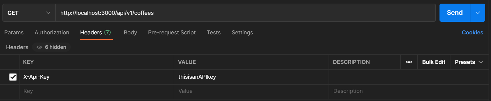

# Mean Beans API

### _This project was created solely for the education of the author(s) and is not in a complete or portfolio-ready state. It should not be considered representative of professional work._
\
[Epicodus](https://www.epicodus.com/) - [Ruby and Rails](https://www.learnhowtoprogram.com/ruby-and-rails) - [Week 6, Lesson 13](https://www.learnhowtoprogram.com/ruby-and-rails/building-an-api/building-an-api-two-day-or-one-week-project)
\
\
Date created: 2021-03-29

## Authors and Contributors
Authored by: Mekinsie Callahan, David Couch, Micah L. Olson

## Description
_Building an API: API of Choice_    
The objective of this lesson is to create a Rails API using RESTful principles, exploring the following topics:
* Building an API that includes full CRUD functionality and nested routes
* Successfully returning JSON objects via Postman and cURL
* Returning headers with the correct HTTP status code
* Testing APIs with rspec request specs
* Documenting your API endpoints
* Handling exceptions when an API call fails

## Mean Beans API Endpoint
* http://localhost:3000/api/v1
* **API KEY required** (see user creation instructions below)
* Using <a href="https://www.postman.com/">`Postman`</a>, you can make the following requests below
  * GET /api/v1/coffees
    * Returns a full list of all coffees in the database
  * POST /api/v1/coffees
    * Adds a coffee to the database with supplied blend name, origin, and notes
  * DELETE /api/v1/coffees/{id}
    * Removes a coffee from the database
  * GET /api/v1/coffees/{id}
    * Fetches a single coffee by id
  * PATCH /api/v1/coffees/{id}
    * Updates a single coffee, fetched by id, with supplied blend name, origin, and notes
  * GET /api/v1/search
    * Returns all coffees containing a search sub-string in 'blend name'
  * Example using an API Key with `Postman`:  
      

## Technologies
<table style="border: 0 solid transparent;">
 <tr>
    <td width=400px>
      <ul>
        <li>Ruby 2.6.5</li>
        <li>Rails 5.2.4</li>
        <li>rake 13.0.3</li>
        <li>Embedded Ruby (ERB)</li>
        <li>PostgreSQL (psql) 12.6</li>
        <li>pg 1.2.3</li>
        <li>Puma 3.12.6</li>
        <li>Bundler 1.17.2</li>
        <li>Test-Driven Development (TDD)</li>
      </ul>
    </td>
    <td width=400px>
      <ul>
        <li>Faker</li>
        <li>RSpec 3.10</li>
        <li>shoulda-matchers 4.5.1</li>
        <li>Pry 0.14.0</li>
        <li>git 2.30.1</li>
        <li>FactoryBot</li>
      </ul>
    </td>
 </tr>
</table>

* * *
## Software Requirements
* **Ruby is required to run this application**
* **PostgreSQL is required to run the database**  

 <a href="https://www.learnhowtoprogram.com/ruby-and-rails/getting-started-with-ruby/installing-ruby">Ruby download instructions</a>  
  <a href="https://www.learnhowtoprogram.com/ruby-and-rails/getting-started-with-ruby/installing-postgres">PosgreSQL download instructions</a>  

## Installation Instructions
1. Navigate to the desired directory where you would like to clone the project to.

2. Once you have chosen your desired directory, clone the github repo using the version control tool `git` (<a href="https://www.learnhowtoprogram.com/introduction-to-programming/getting-started-with-intro-to-programming/git-and-github">download instructions</a>). Typing the following command into your terminal:
```bash
$ git clone https://github.com/mekinsie/gathered_analysis
```
3. Open the project in VSCode by typing the following in your terminal:

``` bash
$ code .
```
* Note: VSCode is a code editing software. If you don't already have it, you can download it <a href="https://code.visualstudio.com/">here</a>

4. While located in the root directory, install gem bundler by typing:

``` bash
$ gem install bundler
```

5. Install gem bundles by typing:

``` bash
$ bundle install
```

6. Create a database for this project by typing the following into your terminal while located in the root directory:
```
$ rake db:create
```

7. Add all tables to the database by typing the following in your terminal:
```
$ rake db:migrate
```

8. Seed the database using Faker by typing the following into your terminal:
```
$ rake db:seed
```
The databse should now be correctly set up. And you may start a local server to interact with the project. 

9. The swagger documentation comes pre setup with this app but when additional routes are added you can use this command to re instantiate the doc files:
```
$ SD_LOG_LEVEL=1 rake swagger:docs
```
10. To start a local server, type the following into your terminal:
```
$ rails s
```
11. Open your default browser and type "localhost:3000" into the search bar and press enter. Here, you will see the live server.

## Running Tests
* This application was created using test-driven development (TDD).
* To run the tests yourself, follow the steps below.

Simply type "rspec" into your terminal while located in the root directory of the project.
``` bash
$ rspec
```
* * *

## License
[GPLv3](https://choosealicense.com/licenses/gpl-3.0/)  
Copyright &copy; 2021 Mekinsie Callahan, David Couch, Micah L. Olson  

## Contact
mekinsie.aja@gmail.com  
dcouch440@gmail.com  
micah.olson@protonmail.com